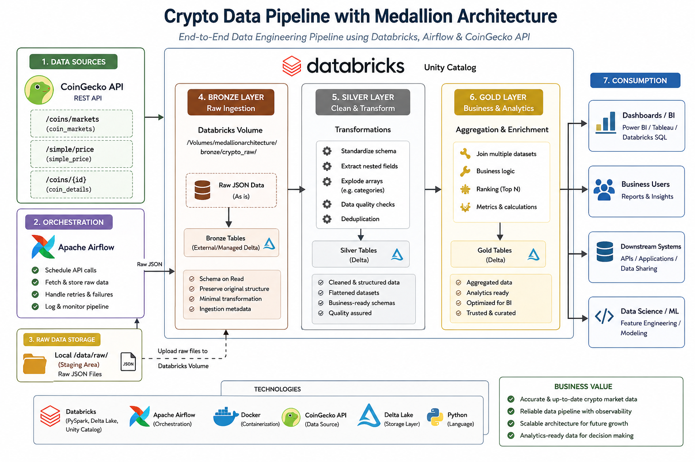

# 🚀 Crypto Data Pipeline with Medallion Architecture (Databricks + Airflow)

## 📌 Overview

This project demonstrates an **end-to-end data engineering pipeline** using the **Medallion Architecture (Bronze → Silver → Gold)** built on **Databricks**.

Data is sourced from the CoinGecko API, ingested as raw JSON, transformed into structured datasets, and finally aggregated into business-ready insights.

The pipeline simulates a real-world modern data platform, including orchestration, storage, transformation, and analytics.

---

## 🏗️ Architecture



End-to-end crypto data pipeline using Medallion Architecture (Bronze → Silver → Gold) on Databricks with Airflow orchestration.*

The pipeline follows the Medallion Architecture:

* 🟫 **Bronze Layer**
  Raw JSON data ingestion from API into Databricks Volume

* 🥈 **Silver Layer**
  Data cleaning, schema standardization, and transformation
  (including flattening nested JSON & exploding array fields)

* 🥇 **Gold Layer**
  Aggregated, analytics-ready dataset (Top Crypto Assets)

---

## ⚙️ Tech Stack

* **Databricks** (PySpark, Delta Lake, Unity Catalog)
* **Apache Spark**
* **Apache Airflow** (Dockerized)
* **CoinGecko API**
* **Docker**

---

## 📊 Data Pipeline Flow

1. Extract data from CoinGecko API using Airflow
2. Store raw JSON data locally (Bronze staging)
3. Load data into Databricks Volume (Bronze layer)
4. Transform and clean data in Silver layer:

   * Normalize schema
   * Extract nested fields
   * Explode array columns (e.g. categories)
   * Apply data quality rules
5. Aggregate data in Gold layer:

   * Join multiple datasets
   * Rank cryptocurrencies by market cap
   * Produce Top N assets

---

## 📁 Project Structure

```plaintext
medallion-architecture-databricks-airflow/
│
├── README.md
├── docker-compose.yaml
│
├── dags/
│   └── pipeline.py              # Airflow DAG for API ingestion
│
├── notebooks/
│   ├── bronze_ingestion.ipynb   # Load raw JSON → Bronze tables
│   ├── silver_ingestion.ipynb   # cleansing and denormalization
│   └── gold_ingestion.ipynb     # Final aggregation 
│   
├── data/
│   └── raw/                     # Local staging (Airflow output)
│
└── docs/
    └── diagram_architecture

```


---

## 🥇 Gold Layer Output

**Table:** `medallionarchitecture.gold.top_crypto_assets`

This dataset provides:

* Top cryptocurrencies ranked by market cap
* Enriched with:

  * pricing data
  * trading volume
  * category classification

Example use cases:

* Market analysis
* Dashboard visualization
* Investment insights

---

## 🧠 Key Features

* ✅ End-to-end Medallion Architecture implementation
* ✅ Multi-source API ingestion (coin_markets, simple_price, coin_details)
* ✅ Handling complex nested JSON structures
* ✅ Exploding array fields for analytics (categories)
* ✅ Data quality checks & deduplication
* ✅ Window functions & ranking logic
* ✅ Separation of orchestration (Airflow) and processing (Databricks)

---

## 🚀 How to Run

### 1. Run Airflow (Docker)

```bash
docker-compose up -d
```

This will:

* Start Airflow services
* Schedule API ingestion
* Store raw JSON data locally

---

### 2. Load Data into Databricks

Upload raw data to Databricks Volume:

```
/Volumes/medallionarchitecture/bronze/crypto_raw/
```

---

### 3. Run Databricks Notebooks

Execute in order:

1. Bronze ingestion notebook
2. Silver transformation notebooks
3. Gold aggregation notebook

---

### 4. Query Final Dataset

```sql
SELECT * 
FROM medallionarchitecture.gold.top_crypto_assets;
```

---

## 📌 Design Decisions

* **Bronze Layer:**
  Preserves raw JSON (including nested & array structures)

* **Silver Layer:**
  Applies transformation and normalization
  Arrays (e.g. categories) are exploded for analytics readiness

* **Gold Layer:**
  Focuses on business value through aggregation and ranking

---

## 🎯 Future Improvements

* Add incremental data loading (CDC / streaming)
* Integrate Databricks Jobs for orchestration
* Add dashboard (Power BI / Tableau)
* Implement data quality framework (e.g. expectations)
* Optimize partitioning strategy

---

